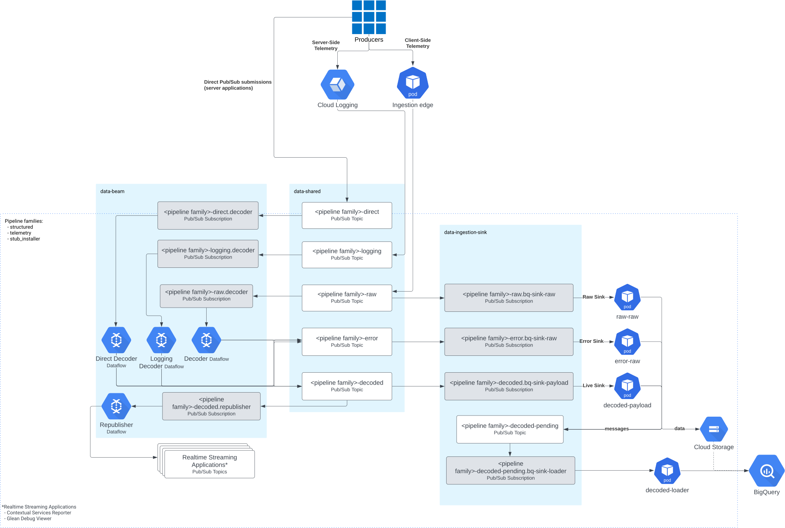

# GCP Ingestion Architecture

This document specifies the architecture for GCP Ingestion as a whole.

<!-- START doctoc generated TOC please keep comment here to allow auto update -->
<!-- DON'T EDIT THIS SECTION, INSTEAD RE-RUN doctoc TO UPDATE -->

- [Architecture Diagram](#architecture-diagram)
- [Architecture Components](#architecture-components)
  - [Ingestion Edge](#ingestion-edge)
  - [Landfill Sink](#landfill-sink)
  - [Decoder](#decoder)
  - [BigQuery Sink](#bigquery-sink)
  - [Dataset Sink](#dataset-sink)
  - [DocType Splitter](#doctype-splitter)
  - [Notes](#notes)
- [Design Decisions](#design-decisions)
  - [Kubernetes Engine and PubSub](#kubernetes-engine-and-pubsub)
  - [Different topics for "raw" and "validated" data](#different-topics-for-raw-and-validated-data)
  - [BigQuery](#bigquery)
  - [Save messages as newline delimited JSON](#save-messages-as-newline-delimited-json)
  - [Use destination tables](#use-destination-tables)
  - [Use views for user-facing data](#use-views-for-user-facing-data)
- [Known Issues](#known-issues)
- [Further Reading](#further-reading)

<!-- END doctoc generated TOC please keep comment here to allow auto update -->

## Architecture Diagram

- The Kubernetes `Ingestion Edge` sends messages from `Producers` (e.g.
  Firefox) to PubSub `Raw Topics`
- The Dataflow `Landfill Sink` job copies messages from PubSub `Raw Topics` to
  `Cloud Storage`
- The Dataflow `Decoder` job decodes messages from PubSub `Raw Topics` to
  PubSub `Decoded Topics`
   - The Dataflow `Decoder` job uses `Cloud Memorystore` to deduplicate
     messages
- The Dataflow `BigQuery Sink` job copies messages from PubSub `Decoded Topics`
  to `BigQuery`
- The Dataflow `Dataset Sink` job copies messages from PubSub `Decoded Topics`
  to `Cloud Storage`
- The Dataflow `DocType Splitter` job copies messages from PubSub `Decoded
  Topics` to `Per DocType Topics`

## Architecture Components

### Ingestion Edge

- Must send messages from producers to PubSub topics
- Must store messages on disk when PubSub is unavailable
   - Must attempt to deliver all new messages to PubSub before storing on disk
   - Must not be scaled down when there are messages on disk
- Must respond server error if PubSub and disk are both unavailable
   - Must use a 5XX error error code
- Must accept configuration mapping `uri` to PubSub Topic
   - Expected initial topics are Structured Ingestion, Telemetry, and Pioneer

### Landfill Sink

- Must copy messages from PubSub topics to Cloud Storage
   - This copy may be for backfill, recovery, or testing
- Must not ack messages read from PubSub until they are delivered
- Must accept configuration mapping PubSub topics to Cloud Storage locations
- Should retry transient Cloud Storage errors indefinitely
   - Should use exponential back-off to determine retry timing

### Decoder

- Must decode messages from PubSub topics to PubSub topics
- Must not ack messages read from PubSub until they are delivered
- Must apply the following transforms in order
  ([implementations here](../../ingestion-beam/src/main/java/com/mozilla/telemetry/decoder/))
   1. Parse `uri` attribute into multiple attributes
   1. Gzip decompress `payload` if gzip compressed
   1. Validate `payload` using a JSON Schema determined by attributes
   1. Resolve GeoIP from `remote_addr` or `x_forwarded_for` attribute into
      `geo_*` attributes
   1. Parse `agent` attribute into `user_agent_*` attributes
   1. Copy attributes to `metadata` top level key in `payload`
   1. Remove duplicates based on `document_id` attribute using Cloud
      Memorystore
      - Must ensure at least once delivery
      - May read from output PubSub topics to determine delivered messages
- Must send messages rejected by transforms to a configurable error destination
   - Must allow error destinations in PubSub and Cloud Storage

### BigQuery Sink

- Must copy messages from PubSub topics to BigQuery
- Must not ack messages read from PubSub until they are delivered
- Must accept configuration mapping PubSub topics to BigQuery tables
- Must accept configuration for using streaming or batch loads
- Must set [`ignoreUnknownValues`](https://beam.apache.org/releases/javadoc/2.7.0/org/apache/beam/sdk/io/gcp/bigquery/BigQueryIO.Write.html#ignoreUnknownValues--)
  to `true`
- Should retry transient BigQuery errors indefinitely
   - Should use exponential back-off to determine retry timing
- Must send messages rejected by BigQuery to a configurable error destination
   - Must allow error destinations in PubSub and Cloud Storage

### Dataset Sink

- Must copy messages from PubSub topics to Cloud Storage
   - May be used to backfill BigQuery columns previously unspecified in the
     table schema
   - May be used by BigQuery, Spark, and Dataflow to access columns missing
     from BigQuery Tables
- Must not ack messages read from PubSub until they are delivered
- Must store messages as newline delimited JSON
- May compress Cloud Storage objects using gzip
- Must accept configuration mapping PubSub topics to Cloud Storage locations
- Should accept configuration mapping message attributes to Cloud Storage object
  names
- Should retry transient Cloud Storage errors indefinitely
   - Should use exponential back-off to determine retry timing

### DocType Splitter

- Must copy messages from PubSub topics to PubSub topics
- Must not ack messages read from PubSub until they are delivered
   - Must ack messages that should not be delivered
- Must accept configuration mapping `document_type`s to PubSub topics
   - Must only deliver messages with configured destinations
- Should accept configuration mapping message attributes to Cloud Storage object
  names
- Should retry transient Cloud Storage errors indefinitely
   - Should use exponential back-off to determine retry timing

### Notes

PubSub stores unacknowledged messages for 7 days. Any PubSub subscription more
than 7 days behind requires a backfill.

Dataflow will extend ack deadlines indefinitely when consuming messages, and
will not ack messages until they are processed by an output or GroupByKey
transform.

Dataflow jobs achieve at least once delivery by *not* using GroupByKey
transforms and *not* falling more than 7 days behind in processing.

## Design Decisions

### Kubernetes Engine and PubSub

Kubernetes Engine is a scalable, managed service based on an industry standard.
PubSub is a simple, scalable, managed service. By comparison a compute instance
group instead of Kubernetes Engine and Kafka instead of PubSub would require
more operational overhead and engineering effort for maintenance.

### Different topics for "raw" and "validated" data

We don't want to have to repeat the validation logic in the case where we have
multiple consumers of the data. Raw data can be sent to a single topic to
simplify the edge service and then validated data can be sent to topics split
by `docType` and other attributes, in order to allow consumers for specific
sets of data.

### BigQuery

BigQuery provides a simple, scalable, managed service for executing SQL queries
over arbitrarily large or small amounts of data, with built-in schema
validation, hyperloglog functions, UDF support, and destination tables
(sometimes called materialized views) for minimizing cost and latency of
derived tables. Alternatives (such as Presto) would have more operational
overhead and engineering effort for maintenance, while generally being less
featureful.

### Save messages as newline delimited JSON

One of the primary challenges of building a real-world data pipeline is
anticipating and adapting to changes in the schemas of messages flowing through
the system. Strong schemas and structured data give us many usability and
performance benefits, but changes to the schema at one point in the pipeline
can lead to processing errors or dropped data further down the pipeline.

Saving messages as newline delimited JSON allows us to gracefully handle new
fields added upstream without needing to specify those fields completely before
they are stored. New columns can be added to a table's schema and then restored
via a BigQuery load operation.

### Use destination tables

For complex queries that are calculated over time-based windows of data, using
destination tables allows us to save time and cost by only querying each new
window of data once.

### Use views for user-facing data

Views we create in BigQuery can be a stable interface for users while we
potentially change versions or implementations of a pipeline behind the scenes.
If we wanted to rewrite a materialized view, for example, we might run the new
and old definitions in parallel, writing to separate tables; when we’re
comfortable that the new implementation is stable, we could cut users over to
the new implementation by simply changing the definition of the user-facing
view.

## Known Issues

 - Hard limit of 10,000 columns per table in BigQuery
 - Max of 100,000 streaming inserts per second per BigQuery table
 - A PubSub topic without any subscriptions drops all messages until a subscription is created
 - API Rate Limit: 20 req/sec

## Further Reading

[Differences from AWS](differences_from_aws.md)
