# Ingestion Testing Workflow

The ingestion-beam handles data flow of documents from the edge into various
sinks. You may be interested in standing up a small testing instance to validate
the integration of the various components.


__Figure__: _An overview of the various components necessary to query BigQuery
against data from a PubSub subscription._

## Setting up the GCS project

Read through [`whd/gcp-quickstart`](https://github.com/whd/gcp-quickstart) for details
about the sandbox environment that is provided by data operations.

* Install the [Google Cloud SDK](https://cloud.google.com/sdk/)
* Navigate to the [Google Cloud Console](https://cloud.google.com/sdk/)
* Create a new project under `firefox.gcp.mozilla.com/dataops/sandbox`
    - `gcloud config set project <PROJECT>`
* Create a PubSub subscription (see `gcp-quickstart/pubsub.sh`)
* Create a GCS bucket
    - `gsutil mb gs://<PROJECT>`
* Enable the [Dataflow API](https://console.cloud.google.com/marketplace/details/google/dataflow.googleapis.com)
* Create a service account and store the key locally


## Bootstrapping schemas from `mozilla-pipeline-schemas`

* Download the latest schemas from `mozilla-pipeline-schemas` using `bin/download-schemas`.
    - This script may also inject testing resources into the resulting archive.
    - A `schemas.tar.gz` will appear at the project root.
* Generate BigQuery schemas using `bin/generate-bq-schemas`.
    - Schemas will be written to `bq-schemas/`.
    ```
    bq-schemas/
    ├── activity-stream.impression-stats.1.bigquery.json
    ├── coverage.coverage.1.bigquery.json
    ├── edge-validator.error-report.1.bigquery.json
    ├── eng-workflow.bmobugs.1.bigquery.json
    ....
    ```
* Update the BigQuery table in the current project using `bin/update-bq-table`.
    - This may take several minutes. Read the script for usage information.
* Verify that tables have been updated by viewing the BigQuery console.


## Building the project

Follow the instructions of the project readme. Here is a quick-reference for a running a job from a set of files in GCS.

```bash
export GOOGLE_APPLICATION_CREDENTIALS=keys.json
PROJECT=$(gcloud config get-value project)
BUCKET="gs://$PROJECT"

path="$BUCKET/data/*.ndjson"
mvn compile exec:java -Dexec.args="\
    --runner=Dataflow \
    --project=$PROJECT \
    --autoscalingAlgorithm=NONE \
    --workerMachineType=n1-standard-1 \
    --numWorkers=1 \
    --gcpTempLocation=$BUCKET/tmp \
    --inputFileFormat=json \
    --inputType=file \
    --input=$path\
    --outputType=bigquery \
    --output=$PROJECT:\${document_namespace}.\${document_type}_v\${document_version} \
    --bqWriteMethod=file_loads \
    --tempLocation=$BUCKET/temp/bq-loads \
    --errorOutputType=file \
    --errorOutput=$BUCKET/error/ \
"
```
